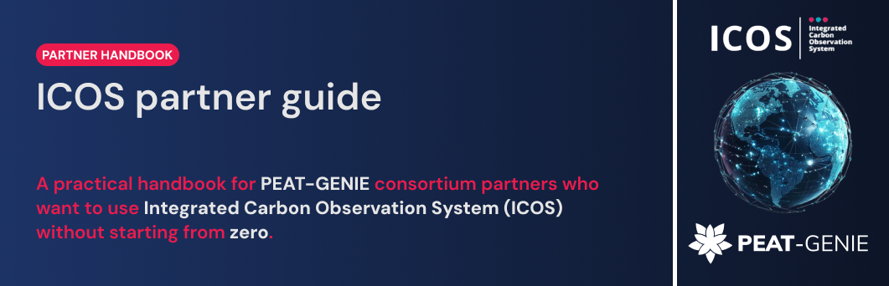
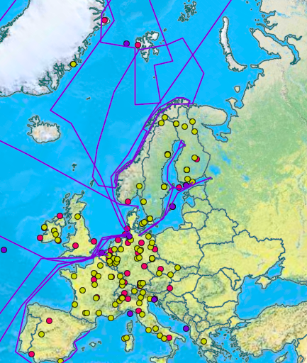

# ICOS partner notebook guide

This short guide introduces the **Integrated Carbon Observation System (ICOS)** and helps PEAT-GENIE partners find and understand ICOS data. It focuses on ecosystem observations and peatland-related stations. Read it directly on GitHub: the notebooks contain text and tables only. You don't need to install software, create an account, or download data to read them.

| Start here | What you will learn |
| --- | --- |
| [01. What is ICOS?](notebooks/01-what-is-icos.ipynb) | The three observation domains, stations, ecosystem fluxes, and the Carbon Portal. |
| [02. Find and understand data](notebooks/02-find-and-understand-data.ipynb) | How to inspect a data product, its level, period, variables, license, and citation. |
| [03. Peatland station examples](notebooks/03-peatland-station-examples.ipynb) | A small set of station pages and how to check which products are actually available. |
| [04. Feature glossary](notebooks/04-feature-glossary.ipynb) | Plain definitions for selected concepts and data fields, with their product context. |

## Selected peatland stations

| Country | Station ID | Station | Peatland type | Station website | Screening table |
| --- | --- | --- | --- | --- | --- |
| Estonia | EE-Pts | Pitsalu | Mire/restored peatland | [ICOS metadata](https://meta.icos-cp.eu/resources/stations/ES_EE-Pts) | [Estonia](Tables/ICOS/estonia_icos_station_screening.xlsx) |
| Estonia | EE-Rng | Ruhingu | Restored peatland | [ICOS metadata](https://meta.icos-cp.eu/resources/stations/ES_EE-Rng) | [Estonia](Tables/ICOS/estonia_icos_station_screening.xlsx) |
| Finland | FI-Let | Lettosuo | Drained and restored forested peatland | [ICOS metadata](https://meta.icos-cp.eu/resources/stations/ES_FI-Let) | [Finland](Tables/ICOS/finland_icos_station_screening.xlsx) |
| Finland | FI-Lom | Lompolojänkkä | Fen/open mire | [ICOS metadata](https://meta.icos-cp.eu/resources/stations/ES_FI-Lom) | [Finland](Tables/ICOS/finland_icos_station_screening.xlsx) |
| Finland | FI-Sii | Siikaneva | Fen | [ICOS metadata](https://meta.icos-cp.eu/resources/stations/ES_FI-Sii) | [Finland](Tables/ICOS/finland_icos_station_screening.xlsx) |
| Greenland | GL-ZaF | Zackenberg Fen | High-Arctic fen | [ICOS metadata](https://meta.icos-cp.eu/resources/stations/ES_GL-ZaF) | [Denmark and Greenland](Tables/ICOS/denmark_greenland_icos_station_screening.xlsx) |
| Ireland | IE-Cra | Clara Raised Bog | Raised bog | [ICOS metadata](https://meta.icos-cp.eu/resources/stations/ES_IE-Cra) | [Ireland](Tables/ICOS/ireland_icos_station_screening.xlsx) |
| Ireland | IE-Dyy | Doory | Drained peat grassland | [ICOS metadata](https://meta.icos-cp.eu/resources/stations/ES_IE-Dyy) | [Ireland](Tables/ICOS/ireland_icos_station_screening.xlsx) |

Visit the [ICOS station network](https://www.icos-cp.eu/measurements/station-network) and [Carbon Portal](https://www.icos-cp.eu/data-services/data-portal) for more details.

Fig. The map of ICOS stations in the EU. 
